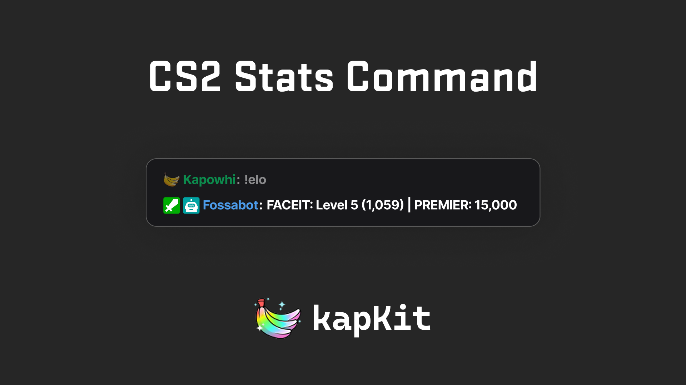

# kapKit — CS2 Stats Command

A free customizer that builds a **CS2 FACEIT + Premier stats command** for your  
chat bot — point it at a Steam profile, pick the datapoints, paste the line in.

 

 

**[How-To Guide](#how-to-guide)** · **[Report a Bug](https://github.com/sidkapahi/kapkit-statcmd/issues)**

---

## Overview

A chat command that stays up to date on its own. Point it at a Steam profile,
pick what to show, and paste one line into your bot. Stats come live from
[Leetify](https://leetify.com) (Premier) and the [FACEIT](https://www.faceit.com)
Data API — nothing to run, no account to make here.

> [!TIP]
> **✨ What you can show**
> - **Premier** — CS Rating and the rating change today
> - **FACEIT** — ELO, skill level, ELO change today, profile link
> - **Today** — wins / losses, average kills, K/D, headshot %

**What viewers see** when they run your command:

> **FACEIT: Level 5 (1,059) | PREMIER: 15,000**

You choose the wording and which datapoints go in it. A datapoint with no data
(no Premier/FACEIT profile, or an upstream hiccup) renders as `-`.

Works with any bot that supports `$(urlfetch …)` — **Nightbot**, **Fossabot**,
**StreamElements**, and others.

## How-To Guide

Nothing to install — the hosted customizer builds your command.

### Before you start

- A **Steam profile link** or Steam64 ID (found on [SteamID I/O](https://steamid.io/)).
  Both Premier and FACEIT stats are looked up from this profile.
- **For FACEIT stats:** a [FACEIT](https://www.faceit.com) account linked to the
  same Steam account.
- **For Premier stats:** a [Leetify](https://leetify.com) account linked to Steam.

### Build your command

1. Open the **[customizer](https://statcmd.kapkit.ca/)**
2. Paste your **Steam profile link** or Steam64 ID
3. Pick your **timezone** — "Today" stats reset at your local midnight
4. Edit the **output** line: type your wording and click the datapoint buttons
   ([Premier](#datapoints), [FACEIT](#datapoints), [Today](#datapoints)) to drop
   in tokens like `{{rating}}` or `{{elo}}`
5. Watch the **live chat preview** update as you go
6. Click **copy** to grab the generated `$(urlfetch …)` line

### Add it to your bot

Create a new command in your bot and paste the copied line as its **response**:

- **Nightbot** — `!commands add !elo <paste>`, or add it in the dashboard
- **Fossabot** — Commands → add command → paste as the response
- **StreamElements** — Chat Commands → add → paste into the response field

Pick any command name you like (`!elo`, `!rank`, `!stats`). That's it — each time
a viewer runs it, the bot fetches fresh stats and posts the line.

## Datapoints

The output line is free text; these `{{tokens}}` are swapped for live values.

| Group | Token | Value |
|---|---|---|
| **Premier** | `{{rating}}` | Current Premier CS Rating |
| | `{{rating.diff}}` | Premier rating change today |
| **FACEIT** | `{{elo}}` | Current FACEIT ELO |
| | `{{lvl}}` | FACEIT skill level (1–10) |
| | `{{elo.diff}}` | FACEIT ELO change today |
| | `{{url}}` | Link to the FACEIT profile |
| **Today** | `{{todays.wins}}` / `{{todays.losses}}` | Today's record |
| | `{{todays.avgKills}}` | Average kills across today's matches |
| | `{{todays.kd}}` | Kills / deaths across today's matches |
| | `{{todays.hs}}` | Average headshot % across today's matches |

"Today" is measured since midnight in the timezone you pick.

## For Developers

Local dev, self-hosting, the Cloudflare Worker, build variables, and analytics
are in **[docs/DEVELOPMENT.md](docs/DEVELOPMENT.md)**; the render engine itself is
documented in **[worker/README.md](worker/README.md)**.

> [!NOTE]
> **A static site that only reads your public CS2 stats.** No login, no accounts,
> nothing personal to hand over — API keys live on the Worker, never in the
> browser. [PRs are very welcome](https://github.com/sidkapahi/kapkit-statcmd/pulls)!

## License

[MIT](LICENSE) © Sid. Not affiliated with Valve, FACEIT, or Leetify.
